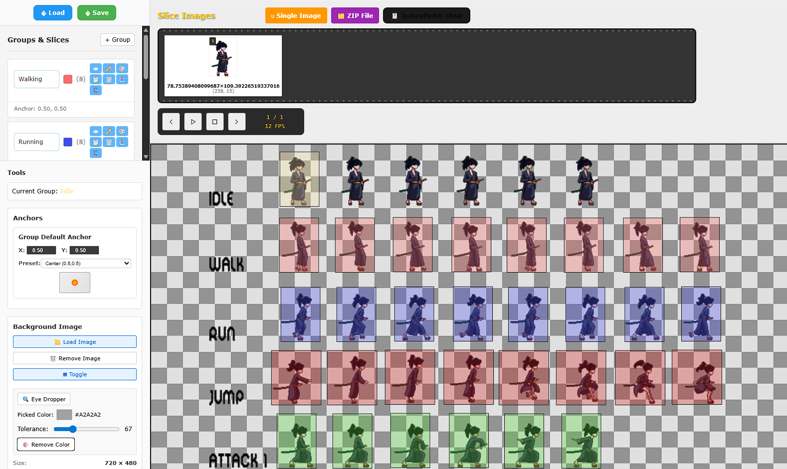

# CutSprite

A powerful web-based sprite sheet cutting tool built with React, TypeScript, and Vite. CutSprite allows you to load sprite sheet images, create precise slices, organize them into groups, and export them in various formats.



## Features

### 🖼️ Image Management

- **Load sprite sheets**: Support for common image formats (PNG, JPG, etc.)
- **Interactive canvas**: 1280x720 canvas with zoom and pan controls
- **Image transformation**: Zoom in/out, reset, and position adjustments
- **Visual feedback**: Real-time preview of slices on the background image

### ✂️ Slice Creation & Management

- **Click & drag**: Create rectangular slices by clicking and dragging on the canvas
- **Precise positioning**: Snap-to-grid functionality for accurate slice alignment
- **Visual handles**: Resize slices using corner and edge handles
- **Selection tools**: Click to select, drag to move existing slices
- **Context menu**: Right-click for quick actions (duplicate, delete)

### 📁 Group Organization

- **Multiple groups**: Organize slices into logical groups with custom names and colors
- **Group operations**: Create, rename, duplicate, and delete groups
- **Visual distinction**: Each group has a unique color for easy identification
- **Batch operations**: Select all slices in a group at once

### 🎬 Animation Preview

- **Frame-by-frame playback**: Preview slices as animation frames
- **Animation controls**: Play, pause, stop, next/previous frame
- **Adjustable FPS**: Control animation speed (1-60 FPS)
- **Film strip view**: Visual representation of all frames in current group

### 💾 Export Options

- **Individual PNGs**: Export each slice as a separate PNG file
- **ZIP archive**: Bundle all slices from a group into a single ZIP file
- **Sprite sheet**: Combine all slices into a single organized sprite sheet
- **Project files**: Save and load complete projects with all groups and settings

### ⚡ Advanced Features

- **Keyboard shortcuts**: Efficient workflow with keyboard controls
- **Smart snapping**: Automatic alignment to existing slices and canvas edges
- **Undo-friendly**: Non-destructive editing workflow
- **Background transparency**: Slices maintain transparency when exported

## Installation

1. Clone the repository:

```bash
git clone https://github.com/tripstych/cutsprite.git
cd cutsprite
```

2. Install dependencies:

```bash
npm install
```

3. Start the development server:

```bash
npm run dev
```

4. Open your browser and navigate to the local development URL (typically `http://localhost:5173`)

## Usage

### Getting Started
1. **Load an image**: Click "📁 Load Image" to select your sprite sheet
2. **Create slices**: Click and drag on the canvas to create rectangular slices
3. **Organize**: Create groups to organize related slices
4. **Export**: Use the export buttons to save your work

### Keyboard Shortcuts
- **Delete/Backspace**: Remove selected slices
- **Escape**: Clear all slices
- **Arrow Keys**: Navigate animation frames
- **Shift + Arrow Keys**: Move background image
- **Space**: Play/pause animation
- **+/-**: Adjust animation FPS

### Mouse Controls
- **Left click + drag**: Create new slice or move existing slice
- **Left click**: Select slice
- **Right click**: Open context menu for slice operations
- **Drag handles**: Resize selected slices

## Project Structure

```
cutsprite/
├── src/
│   ├── App.tsx          # Main application component with UI layout
│   ├── App.css          # Application styles and theming
│   ├── main.tsx         # Core SliceTool class and application logic
│   └── index.css        # Global styles
├── public/              # Static assets
├── package.json         # Dependencies and scripts
└── README.md           # This file
```

## Key Components

### SliceTool Class
The heart of the application, handling:
- Canvas rendering and interaction
- Slice creation, selection, and manipulation
- Group management
- Animation playback
- Export functionality

### UI Panels
- **Sidebar**: Groups management and tool controls
- **Main canvas**: Interactive sprite sheet editing area
- **Film strip**: Animation preview and frame navigation

## Technologies Used

- **React 19**: Modern React with latest features
- **TypeScript**: Type-safe development
- **Vite**: Fast build tool and development server
- **jQuery**: DOM manipulation and event handling
- **JSZip**: ZIP file creation for bulk exports
- **HTML5 Canvas**: High-performance 2D rendering

## Export Formats

### Individual PNGs
Each slice exported as a separate PNG file with transparent background.

### ZIP Archive
All slices from the current group bundled into a single ZIP file for easy distribution.

### Sprite Sheet
Combines all slices into a single image with optimal grid layout, perfect for game engines.

## Browser Support

CutSprite works in all modern browsers that support:
- HTML5 Canvas
- ES6+ JavaScript features
- File API for image loading

## Contributing

1. Fork the repository
2. Create a feature branch: `git checkout -b feature-name`
3. Make your changes and commit: `git commit -m 'Add feature'`
4. Push to the branch: `git push origin feature-name`
5. Submit a pull request

## Development

### Available Scripts

- `npm run dev` - Start development server
- `npm run build` - Build for production
- `npm run preview` - Preview production build
- `npm run lint` - Run ESLint

### Building for Production

```bash
npm run build
```

The built files will be in the `dist` directory, ready for deployment to any static hosting service.

## License

This project is open source. See the repository for license details.

## Acknowledgments

- Built with React and modern web technologies
- Uses Material Design icons for UI elements
- Inspired by traditional sprite sheet editing tools

---

**CutSprite** - Making sprite sheet management simple and efficient! 🎮✨
